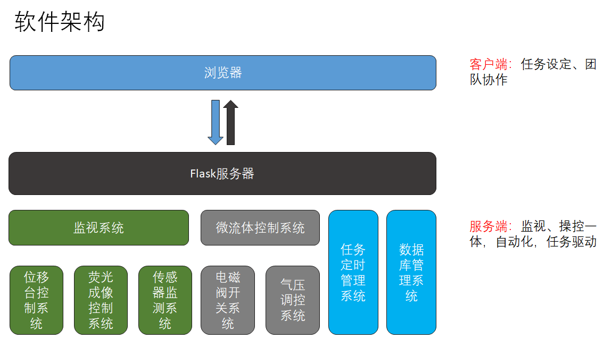
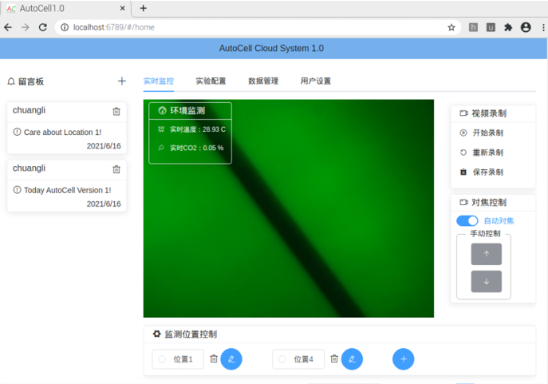
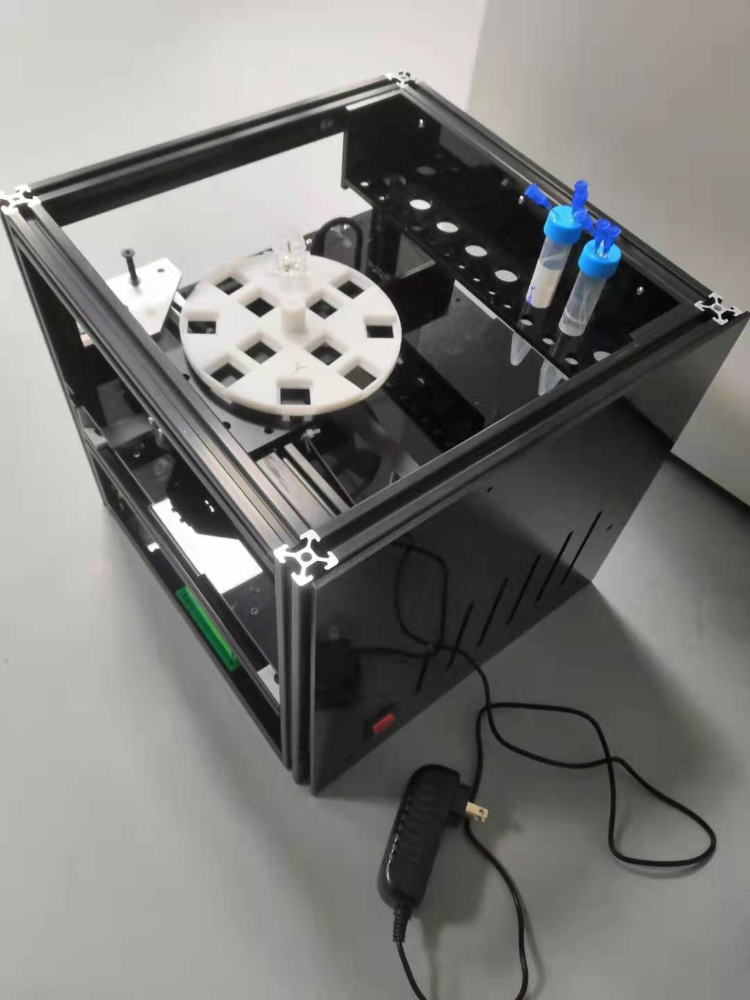

# AutoCell
AutoCell是基于本人毕业设计的开源项目，致力于打造一个自动化的三维细胞培养系统。本项目主要是开发了一个远程可操控的网络系统，用于远程控制细胞培养系统的各个部分：荧光成像系统、位移台控制系统、环境监测系统、培养及监视任务管理系统和实验人员管理系统等, 完成后的整体如下图所示。

本项目前端的开发语言为TypeScript, 开发框架为Vue, 使用了element-ui; 后端部分的开发语言为Python, 使用了Flask作为web框架, 数据库使用了MySQL，前端主题页面如下图所示。

硬件部分的控制核心为一个树莓派4B, 位移台和整体架构使用了定制铝型材加工搭建而成，使用了MKS作为步进电机的控制核心；自行搭建了一个简易的、低成本的小型荧光成像系统，使用470nm的LED作为光源，使用液体镜头作为对焦系统，可以清晰地对520nm的绿色荧光进行成像；系统还具有自动切换试剂的功能，气压源为一小型气泵，气压控制采用比例阀控制大小，电磁阀控制开关的机制，通过定制任务，可以完成不同试剂的切换工作。通过网页可以非常好的进行上述功能的远程控制。

## Build

由于本项目大量使用了嵌入式的通讯和GPIO, 所以本项目的所有的部署和调试都应该基于树莓派进行，当然也可以将树莓派的相关的后端Lib注释掉之后，在PC上调试或者下载。在进行部署之前，你应该在你的设备上安装Node (<=14)和MySQL，在树莓派上为MariaDB数据库。

前端代码在'Web_ui'文件中，你可以打开该文件后，运行`npm i`用于安装依赖，之后你可以执行`npm run build:dev`完成前端部分的编译，之后可以执行`node serve.js`打开前端服务器。

后端代码在'APP'文件中，你可以打开该文件后，运行 `pip install -r requirements.txt`检查并安装相关依赖，之后执行 `python main.py` 运行后端服务器，当然之前你需要配置数据库，相关方法可以自行上网搜索，相关数据结构，可以查看`/APP/db/autocell.sql`, 通过运行示例 `/APP/db/tables.py`,完成数据库的初始化，当然更方便的方式是使用数据库导入的方式，请自行搜索方法，向数据库写入初始用户，其中level为0的用户为管理者.

在完成后端和前端部分的编译与部署后，你可以在浏览器中输入`localhost:6789`来进行调试。

### 硬件部分

### 前端部分

### 后端部分

