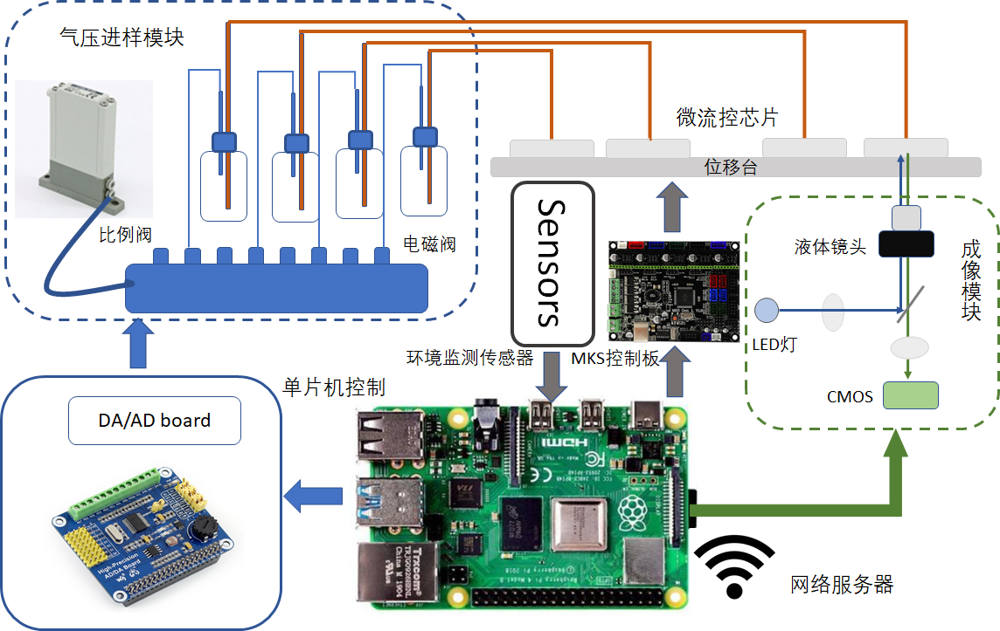
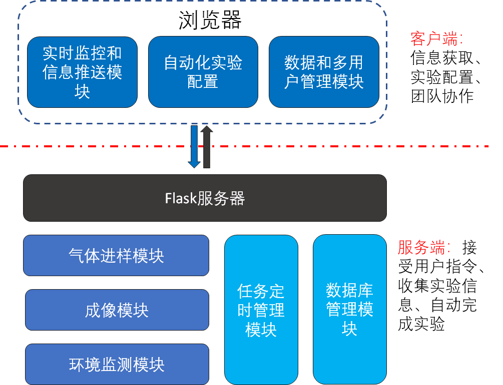

## 培养控制平台网络服务程序

本项目是本人毕业设计中搭建的三维细胞培养控制平台的软件部分。主要为实现远程控制细胞培养箱内的培养控制平台而设计开发。该培养控制平台的及技术架构及完成实物下图所示。本项目即为下图所示的技术架构的软件控制代码。本项目运行的代码基于下图所有的硬件，具体的安装方案详见本人毕业论文。



### 软件架构及文档介绍

本项目的技术架构如下图所示。在本项目中，客户端为一个H5网页项目，开发语言为TypeScript, 开发框架为Vue, 使用了Element-ui，项目文件在Web_UI/; 服务端开发语言为Python, 使用了Flask作为web框架, 数据库使用了MySQL，项目文件在APP/。



项目运行的过程如下图所示：


### 安装与部署

由于本项目大量使用了嵌入式的通讯和GPIO, 所以本项目的所有的部署和调试都应该基于树莓派进行，当然也可以将树莓派的相关的后端Lib注释掉之后，在PC上调试或者下载。在进行部署之前，你应该在你的设备上安装Node (<=14)和MySQL，在树莓派上为MariaDB数据库, 请自行搜索安装方法。请先详细阅读本人毕业论文第三章，将所有的硬件安装好后在进行调试。

下载本项目所有文件：

```git
git clone git@github.com:chuangli1/AutoCell.git
```

#### 服务端

安装所有依赖：

```python
cd APP
python3 -m pip install -r requirements.txt
```

安装mariaDB数据库：

```linux
sudo apt-get install mariadb-server
```

安装完数据库后请初始化数据库，相关方法可以自行上网搜索，并将‘***/APP/db/autocell.sql***’文件导入数据库，更改’***/APP/db/index.py***‘中数据库连接的用户和密码, 向数据库中的‘***user***‘表写入初始用户和密码，并将’**/APP/main.py**'中的managerName改为初始用户。

确保所有的硬件安装完成，运行服务器：

```python
python3 main.py
```

#### 客户端

安装依赖：

```js
npm i
```

编译文件：

```js
npm run build:dev
```

运行：

```js
node server.js
```


#### 本地调试

在完成后端和前端部分的编译与部署后，可以在树莓派的浏览器中输入`localhost:6789`来进行调试，或者在与树莓派连接在一个局域网中的PC浏览器输入`树莓派的IP:6789`来调试。

#### 公网部署

由于本项目部署在树莓派上，而树莓派通过Wifi连接到网络上，因此本项目通过内网穿透工具Frp上部署到公网上，具体部署方法可见[frp]([GitHub - fatedier/frp: A fast reverse proxy to help you expose a local server behind a NAT or firewall to the internet.](https://github.com/fatedier/frp))。


